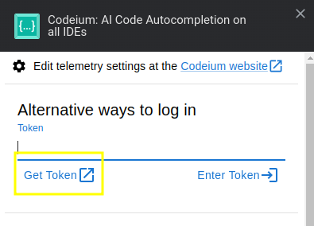
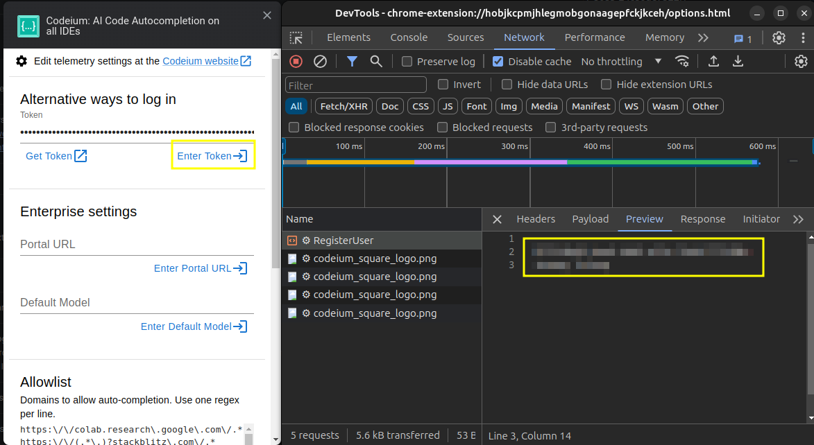
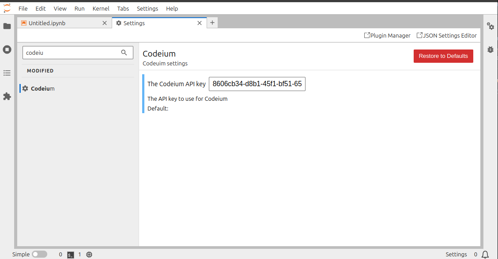
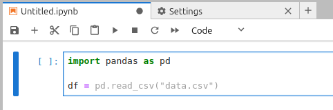

# jupyterlab-codeium

[](https://github.com/jtpio/jupyterlab-codeium/actions/workflows/build.yml)
[](https://jtpio.github.io/jupyterlab-codeium/lab/index.html)

JupyterLab extension to get AI code completions with [Codeium](https://codeium.com/).

https://github.com/jtpio/jupyterlab-codeium/assets/591645/7ec0a6fa-9c51-49a8-89b4-77b431f4bda9

> [!WARNING]
> The Codeium team forked this repo to continue the development: https://github.com/Exafunction/codeium.jupyter

> [!WARNING]
> This extension is still very much experimental. It is not an official Codeium extension.

## ✨ Try it in your browser ✨

1. Follow the instructions in the [Usage](#usage) section to get your API key.
2. Open https://jtpio.github.io/jupyterlab-codeium in your browser

## Requirements

- JupyterLab >= 4.1.0

> [!NOTE]
> This extension is also compatible with [JupyterLite](https://github.com/jupyterlite/jupyterlite) >= 0.3.0

## Install

To install the extension, execute:

```bash
pip install jupyterlab-codeium
```

## Usage

> [!WARNING]
> Setting up the extension requires a Codeium API key. This part might still be challenging as retrieving the key requires a few manual steps at the moment.
> This might later be improved by providing a better auth flow.

1. Go to the Codeium website and sign up for an account: https://codeium.com/
2. Install the browser extension: https://codeium.com/chrome_tutorial
3. Open the settings for the chrome extension and click on "Get Token"



4. Right click on the extension window and select "Inspect" to open the dev tools for the extension. Then click on "Network"
5. Copy the token and paste it the input area, and then press "Enter Token"
6. This should log a new API request in the network tab. Click on "Preview" to get the API key.



7. Go to the settings to paste the API key:



8. You should now be able to use the extension. Open a Python file and start typing to see the completions.



## Contributing

### Packaging and releasing the extension

See [RELEASE](RELEASE.md)

### Credits

Many thanks to the `codemirror-codeium` project for the inspiration and the initial implementation of the Codeium integration with CodeMirror 6: https://github.com/val-town/codemirror-codeium

The protobuf files were copied from that repo and reused as is in this project.
